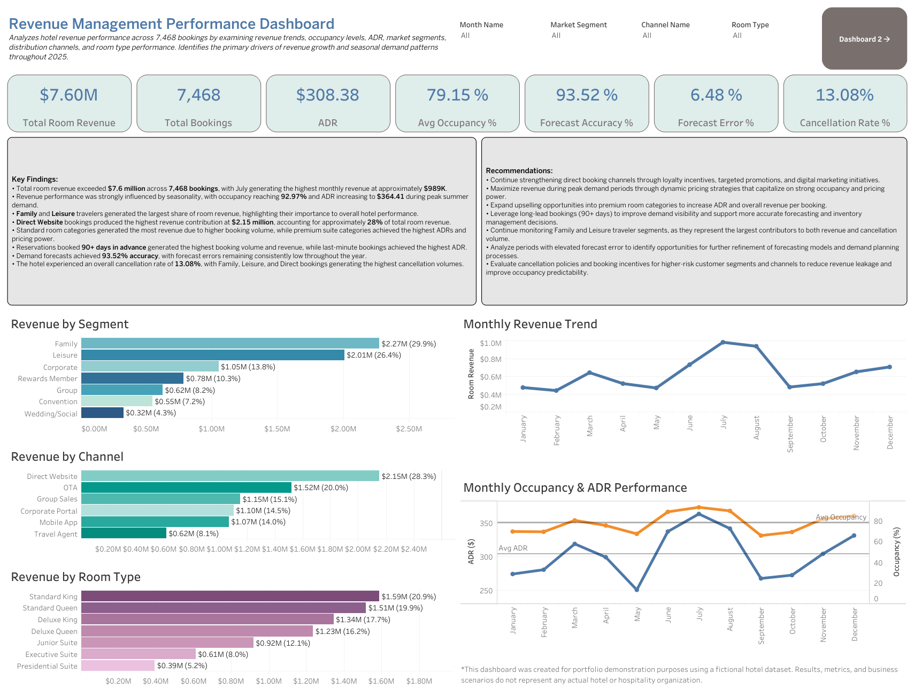
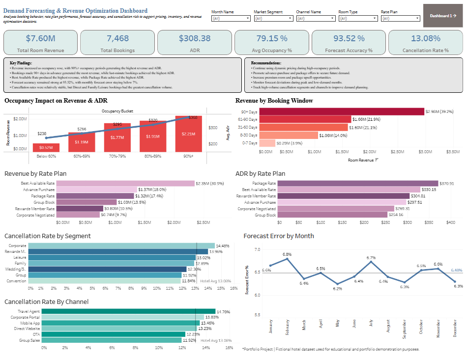

# Revenue Management & Demand Forecasting Dashboards

## Project Overview

This project analyzes hotel revenue performance across 7,468 bookings using SQL and Tableau. The dashboard evaluates revenue trends, occupancy levels, average daily rate (ADR), market segments, distribution channels, booking windows, forecast performance, and cancellation behavior to identify key drivers of revenue growth and demand optimization.

## Tools Used

* SQL (SQLite)
* Tableau Public
* Excel

## Key Performance Indicators

* Total Revenue: $7.60M
* Total Bookings: 7,468
* ADR: $308.38
* Average Occupancy: 79.15%
* Forecast Accuracy: 93.52%
* Forecast Error: 6.48%
* Cancellation Rate: 13.08%

## Key Findings

* Total room revenue exceeded $7.6M, with July generating the highest monthly revenue.
* Occupancy and ADR increased during peak demand periods, driving stronger revenue performance.
* Family and Leisure travelers generated the largest share of total room revenue.
* Direct Website bookings produced the highest revenue among distribution channels.
* Best Available Rate and Package Rate plans generated the strongest revenue performance.
* Forecast accuracy remained above 93%, indicating effective demand forecasting.
* Corporate and Rewards Member segments recorded the highest cancellation rates.

## Recommendations

* Continue strengthening direct booking channels through targeted marketing and loyalty initiatives.
* Leverage dynamic pricing strategies during peak demand periods to maximize ADR and revenue.
* Expand successful rate plans that generate both strong ADR and revenue performance.
* Monitor high-cancellation segments and channels to reduce revenue leakage.
* Maintain forecasting practices that support proactive inventory and pricing decisions.

### Tableau Dashboards

View Interactive Dashboards:

[Tableau Public Dashboards](https://public.tableau.com/app/profile/haley.huitt/viz/RevenueManagementandDemandForecastingDashboard/ExecutiveOverview)

## Disclaimer

These dashboards were created for portfolio and educational purposes using a fictional hotel dataset. Results, metrics, and business scenarios do not represent any real hotel or hospitality organization.
